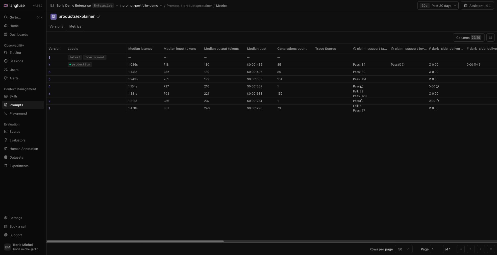

# Full-volume history in the existing project

On 2026-10-09 the user requested: “Create full volume in same project you got above”.
The completed expansion targets [prompt-portfolio-demo](https://cloud.langfuse.com/project/cmv0gc1710815ad0k7nnnd6v5).
The original sample, native configuration and live conversations were preserved.

## Delivered population

| Evidence | Count |
| --- | ---: |
| Historical traces | 1,620 |
| Authored experiment traces | 18 |
| Generations | 2,118 |
| Source retrieval observations | 1,320 |
| Calculator tool observations | 74 |
| Root observations | 1,638 |
| All seeded observations | 5,150 |
| Authored scores | 9,356 |

Nine prompt families, their original eight versions, nine datasets, 12 score
configurations, ten managed evaluators/rules and three synthetic pricing models
were reused. The expansion made no prompt, label, evaluator, connection or project
setting writes. The user's separate protection verification remains the evidence
for protected-label enforcement.

The project also retained nine nonseed traces. Exhaustive readback found 5,161
observations and 9,364 scores in the project, including the existing live results.
The seeded history and experiment scores remain explicitly authored synthetic
examples; this import did not run model judges.

## Preservation and import method

Rebuilding the original small seed at a larger target changes some deterministic
session contents and IDs. Importing that larger spool would therefore duplicate or
conflict with existing records. Langfuse v4 does not deduplicate re-sent observation
IDs ([documented update semantics](https://langfuse.com/faq/all/tracing-data-updates)).

The supported `seed --expand-existing` path instead retains the original 500 events
(48 history traces and 18 experiments, seed 42). It generates only 1,572 additional
history traces with independent seed 43, using the same 2026-10-09 date anchor.
Complete sessions and their internal context stay together. No experiments are
regenerated. The resulting population is reproducible from both recorded seeds;
it is not byte-identical to the earlier single-seed full offline spool.

Before writing, the command checks the source spool hash, successful source receipt,
project identity, retained assets, complete observation inventory and score IDs.
It rejects trace, observation, session or score collisions. An exclusive lock beside
the original receipt prevents retrying through another destination. Only the new
14,006-event supplement is imported, with transport retries disabled. The combined
14,506-event file is evidence only and must never be imported.

Ignored local records:

- Original: `.scratch/portfolio-small-state/`; original receipt and spool unchanged.
- Full receipt: `.scratch/full-volume-expanded-state/.synth_state.json`.
- Import input: `.scratch/full-volume-expanded-state/events.ndjson` (supplement only).
- Verification input: `.scratch/full-volume-expanded-state/combined-evidence.ndjson`.
- Delivered runbook: `.scratch/full-volume-expanded-artifacts/DEMO_SCRIPT.md`.

Use the full receipt and `generation.target_traces=1620` for subsequent verification.
The existing companion remains connected to the same project and retained assets.
No running chat was restarted during the expansion.

## Verification

The [exhaustive inventory audit](evidence/full-volume-inventory.json) passed with
zero failures. It checked all expected observation IDs, trace relationships,
parent IDs, types, prompt versions and sessions, plus every authored score's ID,
name, value, data type and subject. No expected record was missing or duplicated.
All 199 preflight observations remained unchanged on the inspected core/basic/prompt
fields, and all nine nonseed trace inventories were preserved. This exhaustive
inventory check does not claim input/output or metadata equality for every record.

The separate [current-run verification](evidence/full-volume-verification.json)
passed all **248 checks**. Its 61 representative traces additionally verify exact
inputs/outputs, timestamps, rubric metadata and score subjects, alongside the
retained prompt versions, datasets, prices, evaluator definitions/rules and all
18 historical experiment links. Labels are preserved rather than reset or required
to remain at the opening versions. The delivered runbook matches the repository.

The full local suite passed **195 tests**, with manifest validation and conformance
also passing. Independent code review checked collision protection, source
preservation and ambiguous-failure handling. The refreshed local container passed
an isolated smoke under UID 10001, a read-only filesystem, no network and no
credentials; installed code, companion assets and runbook matched the workspace
([container evidence](evidence/full-volume-container-smoke.json)).

## Presenter surface

The native product prompt Metrics view now shows populated version cohorts. In the
observed 30-day view, v1 had 73 generations with median cost $0.001795 and latency
1.478s; production v7 had 85 generations with median cost $0.001436 and latency
1.086s. The historical claim-support categories show six failures in v1 and 23 in
v3, while v7's 84 authored outcomes pass. One live v7 outcome is shown separately
as EVAL. These are the actual displayed results, not an improvement guarantee.

Signed release, Depot admission and delivered staging rehearsal remain separate
pending gates described in [the authoring review](REVIEW.md).
